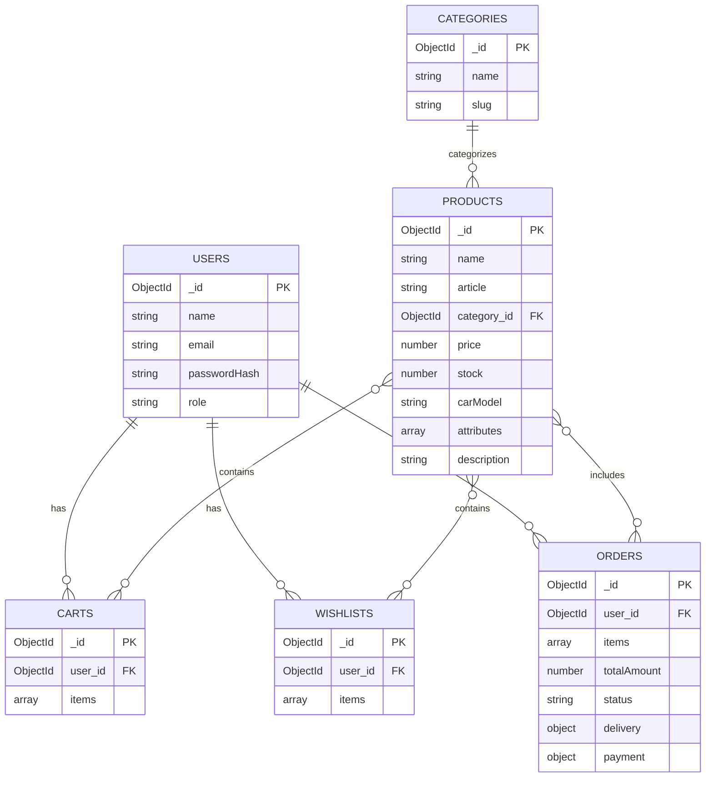

# Технічна специфікація (Specification) — Інтернет-магазин автозапчастин

Цей документ описує архітектуру, модульну структуру, схему даних у MongoDB та ключові сценарії взаємодії для вебзастосунку інтернет-магазину автомобільних запчастин. Стек: **HTML, CSS, Vanilla JS, Node.js (native), MongoDB (native driver)**.

---

## 1. Архітектура, компоненти та модулі

Застосунок побудований на клієнт-серверній архітектурі без сторонніх бекенд-фреймворків. Маршрутизація та обробка запитів виконуються за допомогою нативного модуля `http` у Node.js із розподілом по окремих файлах роутів, а робота з базою даних — через офіційний драйвер `mongodb`.

### Архітектурна схема:

```

[ Клієнт (HTML / CSS / Vanilla JS) ]
│ (HTTP / Fetch API)
▼
[ Сервер (Node.js HTTP Server + Роутери) ]
│ (MongoDB Node.js Driver)
▼
[ База даних MongoDB ]

```

### Повна модульна структура проєкту:

```text
/
├── client/                     # Клієнтська частина
│   ├── index.html              # Головна сторінка каталогу
│   ├── product.html            # Детальна картка товару
│   ├── cart.html               # Кошик покупця
│   ├── wishlist.html           # Список бажаного (обране)
│   ├── auth.html               # Сторінка авторизації та реєстрації
│   ├── checkout.html           # Оформлення замовлення (доставка/оплата)
│   ├── admin.html              # Панель адміністратора (CRUD товарів)
│   ├── css/
│   │   └── style.css           # Загальні стилі інтерфейсу
│   └── js/
│       ├── api.js              # Модуль для виконання fetch-запитів до бекенду
│       ├── auth.js             # Логіка входу, реєстрації та сесій
│       ├── catalog.js          # Відображення каталогу та фільтрів
│       ├── productDetail.js    # Логіка картки товару та динамічних характеристик
│       ├── cart.js             # Логіка керування кошиком
│       ├── wishlist.js         # Логіка списку бажаного
│       ├── checkout.js         # Обробка даних доставки та оплати
│       └── admin.js            # Інтерфейс адміністратора
│
├── server/                     # Серверна частина (Node.js native)
│   ├── server.js               # Головна точка входу (http.createServer)
│   ├── db.js                   # Підключення до MongoDB та кешування клієнта
│   ├── controllers/            # Бізнес-логіка
│   │   ├── authController.js   # Хешування паролів та перевірка автентифікації
│   │   ├── productController.js# Обробка товарів та поліморфних атрибутів
│   │   ├── cartController.js   # Управління кошиком користувача
│   │   ├── wishlistController.js# Управління списком бажаного
│   │   └── orderController.js  # Створення замовлень та розрахунок доставки
│   └── routes/                 # Маршрутизація запитів за модулями
│       ├── authRoutes.js       # Роути для авторизації та реєстрації
│       ├── productRoutes.js    # Роути для каталогу та карток товарів
│       └── orderRoutes.js      # Роути для замовлень, кошика та обраного
│
├── package.json
└── spec.md

```

---

## 2. Структура даних та зв'язки (ER-діаграма MongoDB)



---

## 3. Ключові сценарії та оновлення даних

### Сценарій 1: Авторизація (`auth.html` + `authRoutes.js`)

1. **Клієнт:** Користувач вводить облікові дані на `auth.html`. `auth.js` надсилає POST-запит через `api.js`.
2. **Сервер:** `server.js` спрямовує запит до `authRoutes.js`, який викликає `authController.js`. Контролер перевіряє пароль через хешування в колекції `users`.
3. **Клієнт:** Успішна відповідь зберігається в `localStorage`, після чого відкривається особистий кабінет або головна сторінка.

### Сценарій 2: Перегляд картки товару (`product.html` + `productRoutes.js`)

1. **Клієнт:** Користувач відкриває `product.html?id=...`. `productDetail.js` надсилає GET-запит на сервер.
2. **Сервер:** `productRoutes.js` передає запит до `productController.js`, який витягує документ із колекції `PRODUCTS`, включно з поліморфними параметрами з поля `attributes`.
3. **Клієнт:** Динамічно рендерить технічні характеристики залежно від типу запчастини.

### Сценарій 3: Оформлення замовлення (`checkout.html` + `orderRoutes.js`)

1. **Клієнт:** Користувач заповнює дані доставки та оплати в `checkout.html`, ініціюючи POST-запит.
2. **Сервер:** `orderRoutes.js` і `orderController.js` обробляють запит, перевіряють залишки в колекції `PRODUCTS`, створюють запис в `ORDERS` та зменшують складські залишки. Також очищується кошик у колекції `CARTS`.
3. **Клієнт:** Отримує статус успішного оформлення та перенаправляється на підтвердження.

### Сценарій 4: Адмін-CRUD товарів (`admin.html` + `productRoutes.js`)

1. **Клієнт:** Адміністратор надсилає дані нового товару з панелі керування.
2. **Сервер:** `productRoutes.js` перевіряє права доступу і через `productController.js` виконує `insertOne()` за допомогою нативного драйвера MongoDB в колекцію `PRODUCTS`.
3. **Клієнт:** Отримує оновлений список елементів каталогу в реальному часі.
